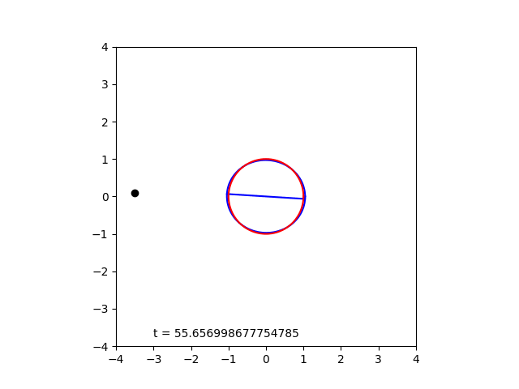
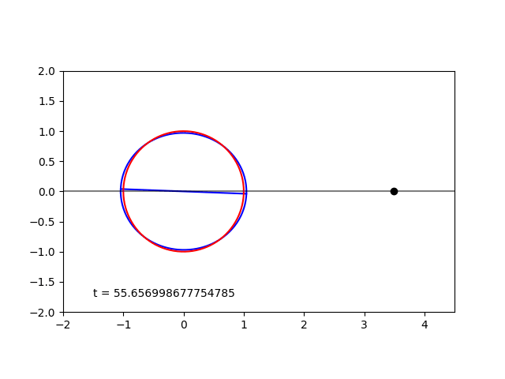
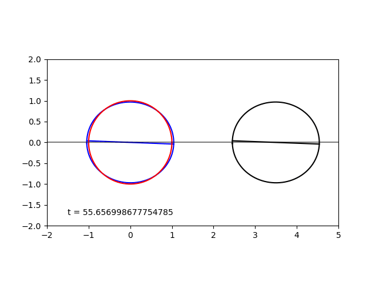

# BNS-tidal-model
## BNS Notebooks
The notebook "BNS-tidal-model" is a consolidated version of all my code that runs independently of any external python files. This notebook has a few plots that the other does not and the animations are rendered directly in the notebook. "BNS-tidal-anim" contains nearly identical code, but the animations are rendered as external .gif files. Both notebooks generate three animations:

1. Stationary reference frame with point mass companion
2. Corotating reference frame with point mass companion
3. Corotating reference frame with tidally perturbed companion

## Partial Animations
These animations do not span the whole time domain of the ODEs; they begin part way into the evolution of the system.

